# Smart Data Pipeline (Self-Building)

> **Status**: MVP Complete (Tier 2: Autonomy)
> **Core Feature**: The system writes *and repairs* its own ingestion code.

## 🌟 The Vision

This is not just a data pipeline; it is an **Adaptive Ingestion Engine**.
Traditional pipelines are brittle: if a website changes its structure, the scraper breaks, and a human must fix it.

This project solves that by employing **AI Agents** that act as the maintenance crew:
*   **The Scout**: Looks at a website and understands the data structure.
*   **The Builder**: Writes the Python code to fetch that data.
*   **The Doctor**: Diagnoses failures and patches broken scrapers automatically.
*   **The Orchestrator**: Coordinates everything and manages the task queue.

---

## 🚀 Quick Start

### Prerequisites
*   Python 3.10+
*   An LLM API Key (Ollama Cloud recommended)

### 1. Install & Configure

```bash
# Install dependencies
pip install -r requirements.txt

# Create .env file with your API keys
cat > .env << EOF
OLLAMA_API_KEY=your-ollama-key
FIRECRAWL_API_KEY=your-firecrawl-key
EOF
```

### 2. Use the CLI

```bash
# Add a new data source
python -m src add "https://example.com/data"

# Check pipeline status
python -m src status

# View task queue
python -m src tasks

# Force repair of a broken source
python -m src fix my_source

# Run the orchestrator loop
python -m src run
```

### 3. Run the Dashboard (Optional)
```bash
make ui
```
*Access at: http://localhost:8501*

---

## 🛠 Tech Stack

| Component | Technology |
|-----------|------------|
| **Language** | Python 3.10+ |
| **LLM** | Ollama Cloud (default) or OpenAI |
| **Database** | SQLite (via SQLAlchemy) |
| **Web Scraping** | Firecrawl MCP |
| **Interface** | CLI + Streamlit |

---

## 🏗 Architecture

### Kernel Tiers

```
Tier 0: Storage (Bronze/Silver)        ✅ Complete
Tier 1: Agents (Scout/Builder)         ✅ Complete  
Tier 2: Autonomy (Doctor/Orchestrator) ✅ Complete
Tier 3: Intelligence (Learning)        📋 Future
Tier 4: Ecosystem (Multi-domain)       📋 Future
```

### The Self-Healing Loop

```mermaid
graph LR
    User[URL] --> Queue[Task Queue]
    Queue --> Scout[Scout Agent]
    Scout -->|Analyzes HTML| Blueprint[Data Blueprint]
    Blueprint --> Builder[Builder Agent]
    Builder -->|Writes Code| Registry[src/registry/*.py]
    Registry --> Runtime[Plugin Registry]
    Runtime -->|Execute| DB[(Database)]
    
    DB -.->|Failure| Health[Health Tracker]
    Health -->|3 Strikes| Doctor[Doctor Agent]
    Doctor -->|Diagnoses| LLM[Ollama LLM]
    LLM -->|Generates Patch| Staging[Staging Registry]
    Staging -->|Validated| Registry
```



---

## 🚀 CLI Reference

| Command | Description |
|---------|-------------|
| `python -m src add <url>` | Queue a new source for discovery |
| `python -m src add <url> --now` | Add and process immediately |
| `python -m src status` | Show health of all sources |
| `python -m src tasks` | View task queue |
| `python -m src fix <source>` | Force repair of a source |
| `python -m src run` | Start orchestrator loop |
| `python -m src run --once` | Process one task and exit |

### Example Session

```bash
$ python -m src add "https://jsonplaceholder.typicode.com/todos" --now
✅ Task queued: [1] ADD_SOURCE → https://jsonplaceholder.typicode.com/todos
🚀 Processing immediately...
[Orchestrator] Scout analyzing...
[Orchestrator] Blueprint created: jsonplaceholder_todos
[Orchestrator] Builder constructing...
[Orchestrator] Plugin created: src/registry/jsonplaceholder_todos.py
✅ Source deployed: jsonplaceholder_todos

$ python -m src status
📊 Pipeline Status
==================================================
Pending Tasks: 0
Total Sources: 1

Health Summary:
  ✅ Active:      1
  ⚠️  Degraded:    0
  🔒 Quarantined: 0
  💀 Dead:        0

Sources:
  ✅ jsonplaceholder_todos    (failures: 0, last: 2025-12-07 04:15)
```


---

## 🔌 API Usage

The system exposes a REST API for integration.

```bash
# Start the server (Local)
python run_server.py

# Start via Docker (Recommended for immutable OS)
docker-compose up --build
```

Access the interactive documentation at:
- **Swagger UI**: http://localhost:8000/docs
- **ReDoc**: http://localhost:8000/redoc

**Key Endpoints**:
- `POST /sources`: Add a new source
- `GET /sources`: List all sources
- `POST /sources/{name}/fix`: Trigger a fix
- `GET /tasks`: View task queue status

---

## 🔧 Configuration

All settings are centralized in `src/core/config.py`:

| Setting | Default | Environment Variable |
|---------|---------|---------------------|
| LLM Provider | `ollama` | `LLM_PROVIDER` |
| LLM Model | `gpt-oss:120b` | `LLM_MODEL` |
| LLM Timeout | `120s` | `LLM_TIMEOUT` |
| Database Path | `data/pipeline.db` | `PIPELINE_DB_PATH` |
| Max Fix Attempts | `3` per day | `MAX_FIX_ATTEMPTS` |
| Quarantine Threshold | `3` failures | `QUARANTINE_THRESHOLD` |

---

## 🧪 Testing

```bash
# Run all tests
python -m pytest tests/ -v

# Run specific test
python -m pytest tests/test_end_to_end_agents.py -v
```

---

## 📂 Project Structure

```text
.
├── config/                 # MCP configurations
├── scripts/                # Setup scripts
├── src/
│   ├── agents/             # AI Agents (base, scout, builder)
│   ├── api/                # FastAPI Application (Routes, Models)
│   ├── core/               # Infrastructure (config, llm, mcp, plugins)
│   ├── ingestion/          # BaseFetcher template
│   ├── orchestration/      # Tier 2: Doctor, TaskQueue, Health, Orchestrator
│   │   ├── doctor.py       # Self-healing agent
│   │   ├── health.py       # Source health tracking
│   │   ├── orchestrator.py # Main coordination loop
│   │   └── task_queue.py   # Persistent task management
│   ├── processing/         # BaseParser contracts
│   ├── registry/           # Dynamic plugins (AI writes here)
│   │   └── staging/        # Patches validated here before production
│   ├── storage/            # Bronze/Silver persistence + orchestration tables
│   └── ui/                 # Streamlit dashboard
├── tests/                  # Verification scripts
├── __main__.py             # CLI entry point
├── VISION.md               # Architecture & roadmap
└── README.md
```

---

## 🔧 Troubleshooting

### Common Issues

*   **`LLM_API_KEY` not set**:
    *   *Symptom*: "No API key found for provider"
    *   *Fix*: Set `OLLAMA_API_KEY` in `.env`

*   **Source stuck in QUARANTINED**:
    *   *Symptom*: Source not being processed
    *   *Fix*: Wait 24h or manually reset via database

*   **Builder generates invalid code**:
    *   *Symptom*: `SyntaxError` in logs
    *   *Fix*: Check `src/registry/<source>.py` manually

*   **Circuit breaker triggered**:
    *   *Symptom*: "Circuit breaker triggered" in logs
    *   *Fix*: Max 3 fix attempts per day per source. Wait or reset.

---

## 📚 Documentation

*   **[Vision & Roadmap](VISION.md)**: Architecture tiers and MVP checklist.
*   **[Storage Design](docs/storage_architecture.md)**: Bronze/Silver data layers.
*   **[Parser Contracts](docs/parser_architecture.md)**: BaseParser interface.
*   **[Dynamic Runtime](docs/runtime_architecture.md)**: Plugin system.

---

## 🤖 Programmatic Usage

```python
from src.orchestration import Orchestrator

# Initialize
orch = Orchestrator()

# Add a source
task = orch.add_source("https://example.com/data")

# Check status
status = orch.status()
print(f"Sources: {status['total_sources']}, Healthy: {status['healthy']}")

# Run orchestrator (blocking)
orch.run()
```

### Direct Agent Usage

```python
from src.agents.scout import ScoutAgent
from src.agents.builder import BuilderAgent

# 1. Scout the site
scout = ScoutAgent()
blueprint = scout.analyze("https://example.com/data")

# 2. Build the plugin
builder = BuilderAgent()
plugin_path = builder.build(blueprint)

print(f"Generated: {plugin_path}")
```

---

## License

MIT
