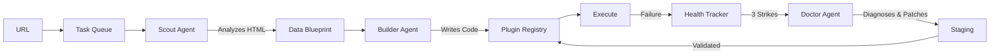

# Smart Data Pipeline

> **An Adaptive Data Ingestion Engine that writes and repairs its own code**

## 🌟 The Vision

Traditional data pipelines are brittle. When a website changes its structure, the scraper breaks, and a human must intervene. This creates a maintenance burden that scales linearly with the number of data sources.

**This project inverts that paradigm.**

Instead of humans maintaining scrapers, **AI agents maintain themselves**. The system employs a crew of specialized agents:

- **The Scout** — Analyzes web pages and understands data structures
- **The Builder** — Generates Python code to extract that data  
- **The Doctor** — Diagnoses failures and patches broken scrapers
- **The Orchestrator** — Coordinates the workflow and manages the task queue

The result is a **self-sustaining data ecosystem** where adding a new data source is as simple as providing a URL. The system handles discovery, code generation, deployment, monitoring, and repair—all autonomously.

---

## 🚀 Getting Started

**Prerequisites:** Python 3.10+, LLM API key (Ollama/OpenAI), Firecrawl API key

**Setup:** Install dependencies with `pip install -r requirements.txt` and configure API keys in `.env`

**Usage:** Add sources with `python -m src add <url>`, check status with `python -m src status`, and run the orchestrator with `python -m src run`

---

## 🎯 Design Philosophy

### 1. **Kernel Isolation**
The system is organized into independent tiers. Each tier can function without the layers above it, ensuring graceful degradation:

```
Tier 0: Storage (Bronze/Silver)        ✅ Complete
Tier 1: Agents (Scout/Builder)         ✅ Complete  
Tier 2: Autonomy (Doctor/Orchestrator) ✅ Complete
Tier 3: Intelligence (Learning)        📋 Future
Tier 4: Ecosystem (Multi-domain)       📋 Future
```

### 2. **The Self-Healing Loop**
The system continuously monitors itself and adapts to change:



When a scraper fails, the Doctor agent:
1. Collects diagnostic context (error logs, HTML diffs, current code)
2. Uses an LLM to generate a patch
3. Deploys the fix to a staging environment
4. Validates the patch before promoting to production

### 3. **Circuit Breakers & Safeguards**
To prevent infinite loops and runaway costs:
- **3-strike quarantine**: Sources that fail repeatedly are quarantined
- **Max 3 fix attempts per day**: Prevents the Doctor from burning through API credits
- **Staging validation**: All patches are tested before production deployment
- **Persistent state**: The system survives restarts and resumes work

### 4. **Data Lineage & Traceability**
Data flows through a two-layer architecture:
- **Bronze Layer**: Raw data exactly as fetched, with full metadata
- **Silver Layer**: Normalized, validated entities ready for consumption

This enables debugging, reprocessing, and schema evolution without data loss.

### 5. **80/20 Rule**
Focus on high-value automation first. The current MVP achieves:
- ✅ Zero-touch source addition (URL → working scraper)
- ✅ Persistent operation (survives restarts)
- ✅ Self-healing (automatic repair of broken scrapers)
- ✅ Observable (CLI + web dashboard)

Advanced features like learning from past fixes and multi-domain federation are deferred to future tiers.

---

## 🏗 Architecture Overview

### Core Components

**Agents** (`src/agents/`)
- Specialized AI workers that analyze, build, and repair data sources
- Share common LLM and MCP (Model Context Protocol) patterns
- Generate executable Python code dynamically

**Orchestration** (`src/orchestration/`)
- Task queue with persistent SQLite storage
- Health tracking with quarantine logic
- Doctor agent for self-healing
- Main orchestrator loop coordinating all workflows

**Storage** (`src/storage/`)
- Bronze/Silver data layers with ELT pattern
- Metadata tracking for lineage and debugging
- Orchestration tables (task queue, health, fix history)

**Plugin Registry** (`src/registry/`)
- Hot-loadable Python modules generated by the Builder
- Staging area for validating patches before production
- Dynamic import system for zero-downtime updates

### Interfaces

**CLI** (`python -m src`)
- Add sources, check status, view tasks, force repairs
- Run the orchestrator in continuous or single-task mode

**Web Dashboard** (Streamlit)
- Real-time health monitoring
- Task queue visualization
- Fix history and audit logs

**REST API** (FastAPI)
- Programmatic access for integrations
- Swagger/ReDoc documentation at `/docs`

---

## 📚 Documentation

- **[VISION.md](VISION.md)** — Detailed roadmap and MVP checklist
- **[docs/USAGE.md](docs/USAGE.md)** — Complete usage guide with commands and examples
- **[docs/ARCHITECTURE.md](docs/ARCHITECTURE.md)** — System architecture and design patterns
- **[docs/CONTRIBUTING.md](docs/CONTRIBUTING.md)** — Development guidelines and code standards
- **[docs/API.md](docs/API.md)** — REST API endpoint reference
- **[docs/DEPLOYMENT.md](docs/DEPLOYMENT.md)** — Production deployment guide

---

## 🛠 Tech Stack

| Component | Technology |
|-----------|------------|
| **Language** | Python 3.10+ |
| **LLM** | Ollama Cloud / OpenAI |
| **Database** | SQLite (via SQLAlchemy) |
| **Web Scraping** | Firecrawl MCP |
| **Interface** | CLI + Streamlit + FastAPI |

---

## 🔮 Future Vision

### Tier 3: Intelligence Kernel
- **Learning from fixes**: When the Doctor successfully repairs a scraper, save the before/after diff to a knowledge base
- **Pattern recognition**: Inject relevant "lessons" into future Builder prompts
- **Data quality validation**: Detect silent failures where code runs but returns invalid data

### Tier 4: Ecosystem Kernel
- **Multi-domain support**: Sports, finance, news, e-commerce
- **Agent marketplace**: Share and import blueprints across instances
- **Federation**: Coordinate multiple pipeline instances
- **Observability**: Prometheus metrics, Grafana dashboards

---

## 📖 License

MIT
