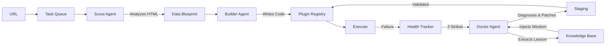

# Smart Data Pipeline

> **An Adaptive Data Ingestion Engine that writes and repairs its own code**

## 🌟 The Vision

Traditional data pipelines are brittle. When a website changes its structure, the scraper breaks, and a human must intervene. This creates a maintenance burden that scales linearly with the number of data sources.

**This project inverts that paradigm.**

Instead of humans maintaining scrapers, **AI agents maintain themselves**. The system employs a crew of specialized agents:

- **The Scout** — Analyzes web pages and understands data structures
- **The Builder** — Generates Python code to extract that data  
- **The Doctor** — Diagnoses failures, patches broken scrapers, and **learns from its own success**
- **The Orchestrator** — Coordinates the workflow and manages the task queue

The result is a **self-sustaining data ecosystem** where adding a new data source is as simple as providing a URL. The system handles discovery, code generation, deployment, monitoring, and repair—all autonomously.

---

## 🚀 Getting Started

**Prerequisites:** Python 3.10+, LLM API key (Ollama/OpenAI), Firecrawl API key

**Quick Start (New in v1.1.0):**
The project is now a fully installed package using `uv`.

```bash
# 1. Install dependencies
uv sync

# 2. Configure Environment
cp .env.example .env
# Edit .env with your keys

# 3. Add a source (The system will build a scraper for you)
uv run python -m src add https://example.com

# 4. Run the Orchestrator
uv run python -m src run
```

---

## 🎯 Design Philosophy

### 1. **Kernel Isolation**
The system is organized into independent tiers. Each tier can function without the layers above it, ensuring graceful degradation:

```
Tier 0: Storage (Bronze/Silver)        ✅ Complete
Tier 1: Agents (Scout/Builder)         ✅ Complete  
Tier 2: Autonomy (Doctor/Orchestrator) ✅ Complete
Tier 3: Intelligence (Learning)        🚧 Alpha (v1.1.0)
Tier 4: Ecosystem (Multi-domain)       📋 Future
```

### 2. **The Self-Healing Loop**
The system continuously monitors itself and adapts to change:



When a scraper fails, the **Doctor Agent**:
1.  **Diagnoses**: Analyzes error logs and HTML diffs using LLM.
2.  **Consults**: Checks the **Knowledge Base** for similar past failures ("Lessons").
3.  **Patches**: Generates a fix and deploys it to staging.
4.  **Learns**: On success, generalizes the fix into a new Lesson for the future.

### 3. **Production Resilience (v1.1.0)**
- **Structured Logging**: JSON logs for machine parsing, colorized console output for humans.
- **Error Recovery**: Automatic retries with exponential backoff for LLM APIs and Database locks.
- **Circuit Breakers**: Prevents infinite loops and cost overruns (Max 3 daily fix attempts).

### 4. **Data Lineage & Traceability**
Data flows through a two-layer architecture:
- **Bronze Layer**: Raw data exactly as fetched, with full metadata
- **Silver Layer**: Normalized, validated entities ready for consumption

This enables debugging, reprocessing, and schema evolution without data loss.

---

## 🏗 Architecture Overview

### Core Components

**Agents** (`src/agents/`)
- Specialized AI workers that analyze, build, and repair data sources.
- **Scout**: Uses Firecrawl/LLM to understand pages.
- **Builder**: Writes Python code from Blueprints.

**Orchestration** (`src/orchestration/`)
- **Task Queue**: Persistent SQLite-backed job management.
- **Health Tracker**: Monitors success/failure rates.
- **Doctor**: The self-healing engine with "The Learner" module.

**Storage** (`src/storage/`)
- **Bronze/Silver**: ELT data layers.
- **Knowledge Base**: Stores learned "Lessons" from fix history.

**Plugin Registry** (`src/registry/`)
- Hot-loadable Python modules generated by the Builder.

---

## 📚 Documentation

- **[VISION.md](VISION.md)** — Detailed roadmap and MVP checklist
- **[docs/USAGE.md](docs/USAGE.md)** — Complete usage guide with commands and examples
- **[docs/ARCHITECTURE.md](docs/ARCHITECTURE.md)** — System architecture and design patterns
- **[docs/CONTRIBUTING.md](docs/CONTRIBUTING.md)** — Development guidelines and code standards
- **[docs/API.md](docs/API.md)** — REST API endpoint reference
- **[docs/DEPLOYMENT.md](docs/DEPLOYMENT.md)** — Production deployment guide

---

## 🛠 Tech Stack

| Component | Technology |
|-----------|------------|
| **Language** | Python 3.10+ |
| **Packaging** | uv / pyproject.toml |
| **LLM** | Ollama Cloud / OpenAI |
| **Database** | SQLite (via SQLAlchemy) |
| **Web Scraping** | Firecrawl MCP |
| **Interface** | CLI + Streamlit + FastAPI |
| **Logging** | Loguru (Structured JSON) |
| **Resilience** | Tenacity (Retries) |

---

## 📖 License

MIT
